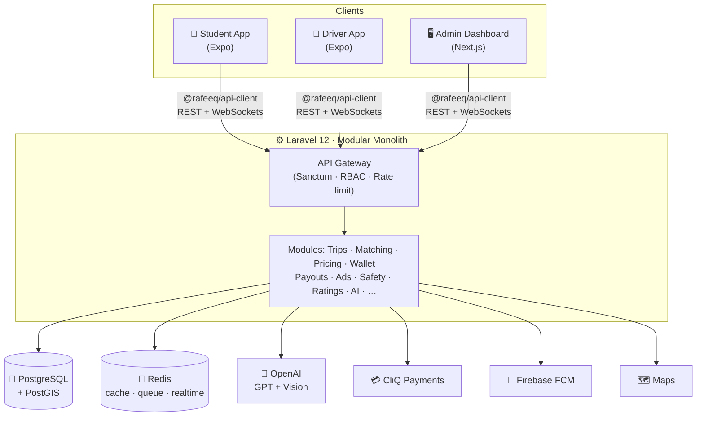
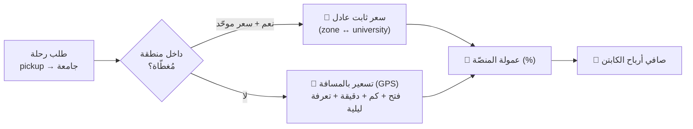

<div align="center">


<br/>

<a href="#"></a>

<br/><br/>


</div>

---

## 🎯 ما هو رفيق؟ · What is Rafeeq?

**رفيق** منصّة متكاملة للنقل الجامعي والخدمات الطلابية في الأردن، مدعومة بالذكاء الاصطناعي.
ليست مجرد تطبيق حجز — بل **شبكة نقل + منصّة خدمات + نظام أمان + مساعد ذكي** في مكان واحد.

Rafeeq is an AI-powered platform for **campus mobility & student services** in Jordan —
pooled rides priced fairly by distance, a captain earnings system, safety controls,
in-app services, and a GPT-powered assistant.

<div align="center">

|  |  |  |
|:--:|:--:|:--:|
| 🚗 **رحلات مُجمّعة** | 💳 **محفظة + CliQ** | 🛡️ **أمان وتتبّع حيّ** |
| تسعير عادل بالمسافة والزون | شحن ودفع واشتراكات | SOS · كود صعود/نزول · مكافحة احتيال |
| 🧭 **مساعد رفيق (AI)** | 📊 **أرباح الكابتن** | 📣 **مساحات إعلانية** |
| اقتراحات ودعم عبر GPT | معاينة + تجميع يومي/أسبوعي | تُدار كلياً من لوحة التحكم |

</div>

---

## 🧩 المنصّة تتكوّن من · The three apps + core

| التطبيق | الوصف | التقنية | المنصّات |
|---------|--------|---------|----------|
| 📱 `frontend/student-app` | تطبيق الطالب | Expo (React Native + TS) | iOS · Android · Web |
| 🚕 `frontend/driver-app` | تطبيق الكابتن | Expo (React Native + TS) | iOS · Android · Web |
| 🖥️ `frontend/admin-dashboard` | لوحة الإدارة | Next.js + TS + Tailwind | Web |
| ⚙️ `backend` | الـ API والمنطق | Laravel 12 · PHP 8.4 | REST + WebSockets |
| 🎨 `frontend/packages/shared` | التصميم والأنواع المشتركة | TypeScript | — |
| 🔌 `frontend/packages/api-client` | عميل API موحّد | TypeScript | — |

---

## 🏗️ المعمارية · Architecture



> **القرار المعماري:** *Modular Monolith* — أسرع للإطلاق، أرخص تشغيلياً، وقابل للتقسيم إلى خدمات لاحقاً.
> المصادقة **stateless Bearer tokens** (Sanctum) لكل العملاء لتفادي تعقيد CSRF.

---

## 💸 نموذج التسعير · Pricing model



- **مصفوفة موحّدة (منطقة↔جامعة):** سعر ثابت متوقّع للطالب داخل منطقته.
- **تسعير بالمسافة:** عند عدم توفّر سعر موحّد — عادل ومبني على GPS.
- **العمولة وكل المفاتيح** قابلة للضبط من لوحة التحكم بلا نشر كود.

---

## 🚀 التشغيل المحلي · Getting started

```bash
# 1) قواعد البيانات
docker compose up -d

# 2) الـ Backend  (Laravel 12 · PHP 8.4)
cd backend
cp .env.example .env
composer install
php artisan key:generate
php artisan migrate --seed
php artisan serve
#   الجودة: composer test  ·  composer stan  ·  ./vendor/bin/pint

# 3) الـ Frontend  (workspace واحد تحت frontend/)
cd frontend
npm install
npm run student   # تطبيق الطالب
npm run driver    # تطبيق الكابتن
npm run admin     # لوحة الإدارة
#   التحقق: npm run typecheck --workspace=admin-dashboard
```

---

## 🗂️ بنية المشروع · Project structure

```
Rafeeq-JO/
├── backend/                 ⚙️  Laravel 12 modular monolith
│   ├── Core/                    نواة مشتركة (Http · Audit · Support · Permissions)
│   ├── Modules/                 وحدات المجال (Trips · Pricing · Wallet · Ads · …)
│   ├── Infrastructure/          تكاملات خارجية (Gpt · Maps · Sms · Push)
│   └── tests/                   194 اختبار (Feature + Unit + عقود التكامل)
├── frontend/
│   ├── student-app/         📱  Expo
│   ├── driver-app/          🚕  Expo
│   ├── admin-dashboard/     🖥️  Next.js
│   └── packages/            🎨  shared (theme/i18n/types) + api-client
└── docs/                    📚  توثيق مرقّم نظيف (00–12)
```

---

## 📚 التوثيق · Documentation

| # | الملف | الوصف |
|---|------|-------|
| 00 | [الرؤية](docs/00-VISION.md) | فكرة المشروع ومزاياه (غير تقني). |
| 01 | [الخطة الرئيسية](docs/01-MASTER-PLAN.md) | **مصدر التخطيط والحالة الوحيد.** |
| 02 | [التسعير والمناطق](docs/02-PRICING-ZONES.md) | محرّك التسعير بالمسافة + العمولة. |
| 03 | [نظام التصميم (Stitch)](docs/03-DESIGN-SYSTEM.md) | **الهوية الوحيدة المعتمدة.** |
| 04 | [المزايا](docs/04-FEATURES.md) | كتالوج المزايا + الإعلانات + AI. |
| 05–09 | [المعمارية](docs/05-ARCHITECTURE.md) · [قاعدة البيانات](docs/06-DATABASE.md) · [الأمان](docs/07-SECURITY.md) · [النشر](docs/08-DEPLOYMENT.md) · [العلامة](docs/09-BRAND-NAMING.md) | مراجع تقنية. |
| 10 | [مطابقة شاشات Stitch](docs/10-STITCH-SCREENS.md) | خريطة كل شاشة مقابل التصميم. |
| 11 | [اصطلاح الكوميت](docs/11-COMMIT-CONVENTION.md) | **الترقيم والصيغة الرسمية.** |
| 12 | [عقد التكامل](docs/12-INTEGRATION-CONTRACT.md) | ضمان تطابق الفرونت↔الباك إند. |

---

## 🛣️ خطة التنفيذ · Roadmap

| المرحلة | الوصف | الحالة |
|:---:|---|:---:|
| 0 | التأسيس والترتيب | ✅ 100% |
| 1 | أساس تصميم Stitch | ✅ 100% |
| 2 | إعادة بناء شاشات التطبيقات الثلاثة | ✅ 100% |
| 3 | التسعير بالمسافة + الزون + العمولة | ✅ 100% |
| 4 | الأمان (طبقة التطبيق) | ✅ 100% |
| 5 | التكامل والصحّة (عقود حيّة) | ✅ 100% |
| 6 | AI (GPT) + مزايا + إعلانات | 🔄 جارية |
| 7 | صلابة الإطلاق (نشر/قانوني) | ⏳ |

> التفاصيل الحيّة خطوة بخطوة في [docs/01-MASTER-PLAN.md](docs/01-MASTER-PLAN.md).

---

## 🤝 المساهمة · Contributing

- اصطلاح الكوميت (إلزامي): [`docs/11-COMMIT-CONVENTION.md`](docs/11-COMMIT-CONVENTION.md) — صيغة `[RFQ-<n>] type(scope): summary` بترقيم تسلسلي صارم.
- قبل أي دمج: `composer test` + `composer stan` (backend) و `npm run typecheck` (frontend) — كلها خضراء.

<div align="center">


**© رفيق Rafeeq — جميع الحقوق محفوظة · All rights reserved.**

</div>
