<div align="center">

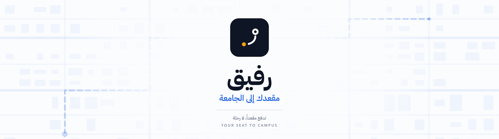

### مقعدك إلى الجامعة

**منصّة النقل الجامعي المشترك في الأردن.**
نجمع طلاب المنطقة نفسها في رحلة واحدة إلى الجامعة — بسعر ثابت معلن قبل الطلب.
الطالب يدفع **مقعداً**، لا **رحلة**.

<br/>

[](https://github.com/hamzatal/Rafeeq-JO/actions/workflows/ci.yml)

-4169E1?style=flat-square)


<br/>

[الفكرة](#الفكرة) · [التسعير](#التسعير--المقعد-الثابت) · [التطبيقات](#التطبيقات-الثلاثة--كل-شاشة) · [الشعار](#الشعار--الطريق-هو-الحرف) · [الألوان](#الألوان--المرجع-الكامل) · [المزايا](#المزايا) · [البنية](#البنية-التقنية) · [التشغيل](#التشغيل-المحلي) · [الحالة](#حالة-المشروع--بصراحة)

</div>

---

<div align="center">
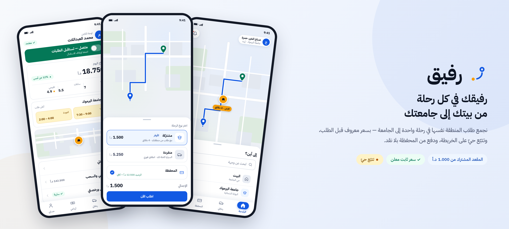
</div>

---

## الفكرة

طالب في إربد يسكن على 6 كيلومترات من جامعة اليرموك أمامه ثلاثة خيارات، وكلّها سيّئة:

| الخيار | الكلفة | المشكلة |
|---|---|---|
| تكسي إلى المجمّع، ثم باص | ~2.000 د.أ + أجرة الباص | انتظار، وتبديل مركبة، ووقت غير مضمون |
| تكسي مباشر إلى الجامعة | 3–4 د.أ يومياً | ≈ 70 د.أ شهرياً — فوق قدرة معظم الطلاب |
| مركبته الخاصة | وقود + اصطفاف | لا يملكها معظمهم |

**رفيق يضيف الخيار الرابع:** الطلاب المتقاربون سكناً والمتّجهون إلى الجامعة نفسها في الوقت نفسه
يتشاركون مركبة واحدة، فينقسم ثمنها. الطالب يدفع **مقعداً** لا **رحلة**.

```
┌─ حي الجامعة ──┐
│  4 طلاب       │ ─────►  مركبة واحدة  ─────►  جامعة اليرموك
│  6.4 كم       │         كابتن موثَّق             البوابة الشمالية
└───────────────┘
   1.500 د.أ للطالب              6.000 د.أ للرحلة
   بدل 3.500 منفرداً             ربح الكابتن 5.100
```

والعكس صحيح: من الجامعة إلى البيت. ومَن أراد المركبة كاملة لنفسه دفع مقاعدها كلّها.

> **القيمة ليست في إرسال مركبة — بل في التجميع.** لهذا المنصّة تجمع الطلبات في نافذة
> زمنية قصيرة قبل الإرسال، لا لتُبطئ الطالب، بل لأنّ رحلة بمقعدين لا تُجدي الكابتن،
> وتغطية العجز من جيب الطالب تنقض وعد السعر الثابت. التفصيل في [`docs/product/PRICING.md`](docs/product/PRICING.md).

---

## التسعير — «المقعد الثابت»

سعر المقعد يُقرأ من **مصفوفة نطاقات معلَنة** (منطقة ↔ جامعة)، لا من عدّاد GPS ولا مضاعف ذروة.
الطالب يعرف كلفته **قبل** أن يطلب، وتبقى هي نفسها كلّ يوم.

<table>
<tr><th>النطاق</th><th>المسافة</th><th>سعر المقعد</th><th>المركبة كاملة</th></tr>
<tr><td><b>A</b></td><td>حتى 3 كم</td><td><b>1.000</b></td><td>3.500</td></tr>
<tr><td><b>B</b></td><td>3–5 كم</td><td><b>1.250</b></td><td>4.500</td></tr>
<tr><td><b>C</b></td><td>5–7 كم</td><td><b>1.500</b></td><td>5.250</td></tr>
<tr><td><b>D</b></td><td>7–10 كم</td><td><b>1.750</b></td><td>6.000</td></tr>
<tr><td><b>E</b></td><td>10–14 كم</td><td><b>2.000</b></td><td><b>7.000</b></td></tr>
<tr><td><b>F</b></td><td>فوق 14 كم</td><td><b>2.250</b></td><td>8.000</td></tr>
</table>

- **المقعد المشترك يبقى تحت الدينارين** حتى النطاق D — وهو يغطّي معظم أحياء إربد حول اليرموك.
- **المركبة كاملة** = `سعر المقعد × مقاعد المركبة × 0.875`، مقرَّبة لأقرب 250 فلساً.
- **لا `surge` ولا مضاعف ليلي على المقعد.** السعر الذي رآه الطالب هو الذي يُخصم.

### طريقتا الدفع

| الطريقة | كيف تعمل |
|---|---|
| **المحفظة** | يُخصَم عند تأكيد الصعود، والمنصّة تحوّل حصّة الكابتن |
| **نقداً للكابتن** | يدفع الطالب في المركبة **بنفس المبلغ المعلن**، والكابتن يؤكّد الاستلام |

**والنقد ليس «تخطّي الخصم».** إضافته تعكس اتجاه المال: على المحفظة تحمل المنصّة الأجرة وتدفع
للكابتن حصّته؛ وعلى النقد **يحمل الكابتن الأجرة كاملة فيصبح مديناً للمنصّة بالعمولة**. وهذا
يحوّل المنصّة إلى **دائن**، فاحتاج تصميماً لا مجرّد علَم:

| القرار | السبب |
|---|---|
| **الأجرة تُسجَّل بسعر النطاق المعلن** | الكابتن يقبض الورق **لا يحدّد السعر**. لا شيء يُناقَش في المركبة، والقيد المحاسبي مطابق للمحفظة تماماً |
| **العمولة تُخصَم من رصيد الكابتن فوراً** | ومن كان له أرباح من رحلات بالمحفظة **لا يتحمّل شيئاً إضافياً** |
| **الفارق يُسجَّل ديناً موجباً لا رصيداً سالباً** | فيبقى `balance_fils` يعني شيئاً واحداً، ويبقى الدَين **قابلاً للاستعلام** |
| **الدَين له سقف، والسقف يمنع الاتصال** | **لا يمنع رحلة جارية** — قطع رحلة لتحصيل دَين لا يُدافَع عنه |
| **الأرباح تُسوّي الدَين تلقائياً** | فلا يُطلَب من الكابتن أن يتذكّر |

> ⚠️ نموذج التسعير مُصمَّم وموثَّق، وتنفيذه **المرحلة 5** من خطة العمل. سبعة أرقام
> (العمولة، طول نافذة التجميع، سقف الضمان…) موثّقة في [`docs/product/PRICING.md`](docs/product/PRICING.md) §7.

---

## التطبيقات الثلاثة — كل شاشة

**77 شاشة** في المشروع: 27 للطالب · 21 للكابتن · 29 للإدارة.
والصور أدناه **مُصمَّمة بالكامل من نظام التصميم نفسه** — نفس التوكنز التي سيُبنى بها الكود —
ومولَّدة برمجياً من [`docs/design/src/`](docs/design/src/) فلا تنحرف عن الهوية.

الجرد الكامل شاشةً شاشة، بحالة كل واحدة: **[`docs/design/SCREENS.md`](docs/design/SCREENS.md)**

---

### ١ · الطالب — رحلة الطلب

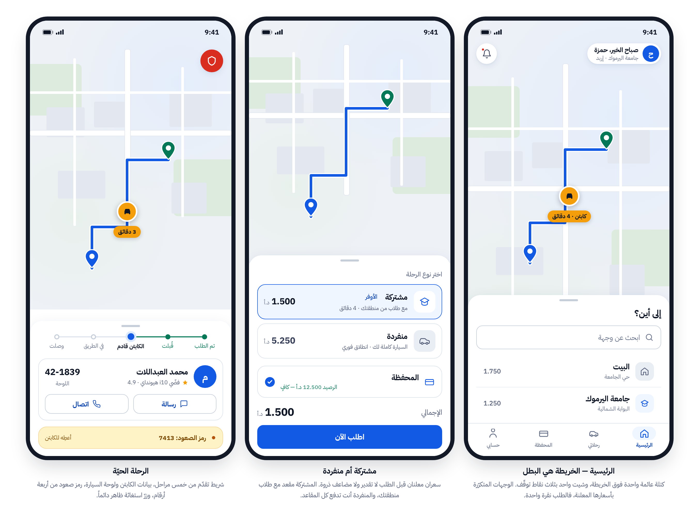

| الشاشة | ما فيها ولماذا |
|---|---|
| **الرئيسية** (يميناً) | الخريطة تملأ الشاشة لأنّها السياق الحقيقي للقرار. فوقها **كتلة عائمة واحدة فقط**، وشيت سفلي فيه البحث وثلاث وجهات متكرّرة **بأسعارها المعلنة** — فالطلب اليومي نقرة واحدة لا رحلة عبر أربع شاشات. |
| **نوع الرحلة** (وسطاً) | خيارَان صريحان بسعرَيهما: **مشتركة** (مقعد مع طلاب منطقتك) و**منفردة** (المركبة كاملة). وتحتهما حالة المحفظة **قبل** الضغط على «اطلب» لا بعده برسالة خطأ. |
| **الرحلة الحيّة** (يساراً) | شريط تقدّم من خمس مراحل يجيب «وين صار؟» بلا قراءة. بيانات الكابتن ولوحة المركبة **بحجم يُقرأ من بعيد**. **ورمز صعود من أربعة أرقام** يمنع رُكوب المركبة الخطأ. وزرّ الاستغاثة أحمر وظاهر **دائماً**. |

### ٢ · الطالب — المال

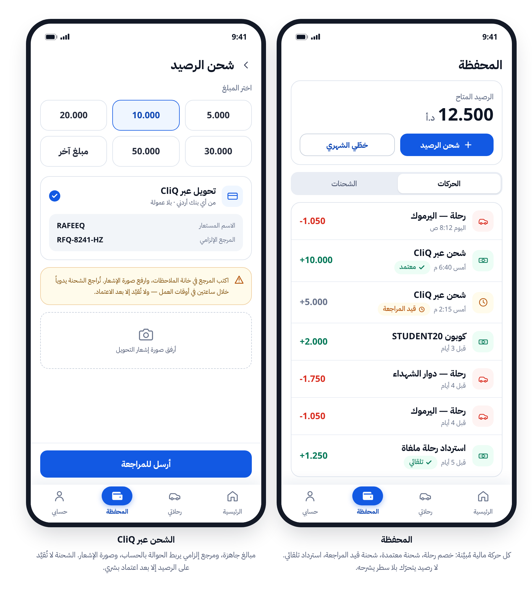

| الشاشة | ما فيها ولماذا |
|---|---|
| **المحفظة** (يميناً) | كل حركة لها سطر يشرحها: خصم رحلة، شحنة **معتمدة**، شحنة **قيد المراجعة** (بلون التحذير ورصيدها غير محتسب)، استرداد **تلقائي**. القاعدة: **لا رصيد يتحرّك بلا سطر يفسّره** — شرط قابلية التدقيق لا رفاهية تصميم. |
| **الشحن عبر CliQ** (يساراً) | مبالغ جاهزة، و**مرجع إلزامي** يربط الحوالة بالحساب، وصورة الإشعار. والشريط الكهرماني يقول الحقيقة صراحةً: **الشحنة لا تُقيَّد إلّا بعد اعتماد بشري** — لأنّ إخفاء ذلك يُنتج شكوى لكل شحنة. |

> **وللدفع نقداً:** الطالب الذي لا يملك حساباً بنكياً — وهو الغالب في 18–22 — يدفع للكابتن
> **بنفس المبلغ المعلن في التطبيق**، والرحلة تُسجَّل كاملة. والعمولة تُستوفى **من الكابتن** لا منه.

### ٣ · الكابتن

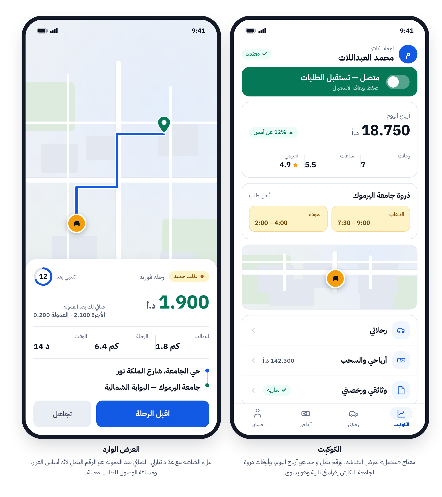

| الشاشة | ما فيها ولماذا |
|---|---|
| **الكوكبِت** (يميناً) | يُقرأ في ثانية وسائقُه يسوق. مفتاح «متصل» بعرض الشاشة كاملاً لأنّه القرار الأهمّ في يوم الكابتن. **رقم بطل واحد** هو أرباح اليوم — لا ستّ بطاقات متساوية الوزن. وأوقات ذروة الجامعة معلنة فيخطّط يومه. |
| **العرض الوارد** (يساراً) | ملء الشاشة مع عدّاد تنازلي. والرقم البطل هو **الصافي بعد العمولة** لا الأجرة الكاملة، لأنّه أساس قرار القبول — وإظهار الأجرة بحجم أكبر **تضليل**. ومسافة الوصول للطالب معلنة، فلا يقبل رحلة تُكلّفه أكثر ممّا تُدخل. وأزرار **54 بكسل** لأنّ الإصبع مرتجفة والمركبة متحرّكة. |

### ٤ · لوحة الإدارة

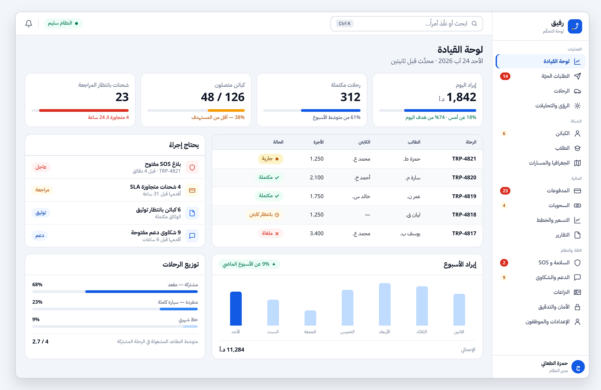

**لوحة تشغيل لا لوحة تقارير.** سايدبار **فاتح** مقسَّم إلى أربع مجموعات (العمليات · الشبكة ·
المالية · الثقة والنظام) مع شارات عدّ على ما يحتاج تدخّلاً. والصفحة مبنية على سؤال واحد:
**ما الذي يحتاج قراراً الآن؟**

- **أربعة مؤشّرات** لكلٍّ شريط تقدّم نحو هدفه ونصّ يفسّره — **رقم بلا مرجع لا يعني شيئاً**. والمؤشّر الكهرماني (كباتن متصلون 38%) والأحمر (23 شحنة بانتظار المراجعة) يقولان «تدخّل» بلا قراءة.
- **بطاقة «يحتاج إجراءً» تسبق كل شيء**: بلاغ SOS مفتوح · شحنات تجاوزت SLA · كباتن بانتظار توثيق · شكاوى دعم.
- و**متوسّط المقاعد المشغولة (2.7 من 4)** — وهو **مؤشّر صحّة نموذج العمل نفسه** لا رقم عرض.

---

### ٥ · الصفائح الكاملة — 41 شاشة في إطار هاتف حقيقي

| الصفيحة | المحتوى |
|---|---|
| [`00-logo`](docs/design/v2/00-logo.png) | الشعار: البناء · التشريح · القفلات · أيقونات المتجر · السبلاش · الاستخدام الخطأ |
| [`02-student-auth`](docs/design/v2/02-student-auth.png) | التمهيد · الدخول · OTP · التسجيل · **بوّابة السنّ 18** · التوثيق |
| [`03-student-ride`](docs/design/v2/03-student-ride.png) | الرئيسية · البحث · نوع الرحلة · التأكيد · البحث عن كابتن · الرحلة الحيّة · التقييم |
| [`04-student-money`](docs/design/v2/04-student-money.png) | المحفظة · CliQ · الكوبونات · «خطّي الشهري» · فاتورة الرحلة |
| [`05-driver`](docs/design/v2/05-driver.png) | الكوكبِت · العرض · الملاحة · الصعود بالرمز · الإنهاء · الأرباح · الوثائق |
| [`06-admin-1`](docs/design/v2/06-admin-1.png) · [`-2`](docs/design/v2/06-admin-2.png) · [`-3`](docs/design/v2/06-admin-3.png) | لوحة القيادة · الطلبات · الكباتن · المدفوعات · السحوبات · التسعير · SOS · التدقيق |
| [`07-states`](docs/design/v2/07-states.png) | **الحالات الفارغة والأخطاء والتحميل وانقطاع الشبكة** — لكل شاشة حالتها |
| [`08-responsive`](docs/design/v2/08-responsive.png) | من 360 إلى 1440 بكسل · هاتف صغير · هاتف · لوحي · سطح مكتب |
| [`09-density`](docs/design/v2/09-density.png) | قبل/بعد ضبط الكثافة — **3 صفوف مرئية صارت 5** مع بقاء اللمس ≥ 44 |

---

### ٦ · أندرويد — أربعة أجهزة حقيقية

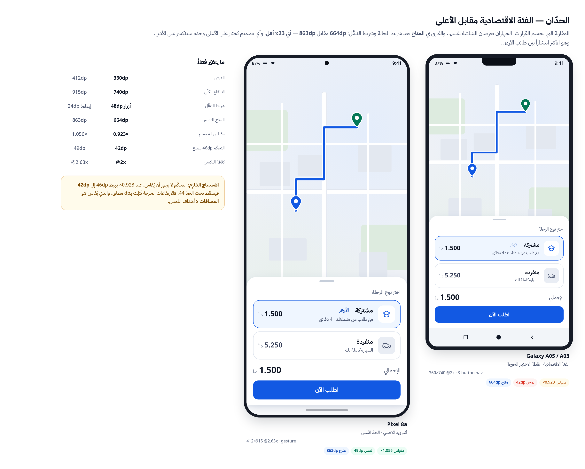

**الإطارات ليست صوراً مقصوصة.** التصميم مؤلَّف على عرض 390 ويُقاس إلى عرض كل جهاز الفعلي —
وهو بالضبط ما يفعله تخطيط React Native بعرض نسبي. فالنصّ وأهداف اللمس تظهر **بحجمها الحقيقي**.
والطبقة أندرويدية لا آيفون: شريط حالة بنسبة بطارية، وثقب كاميرا لا شقّ، و**شريط تنقّل يأكل من
ارتفاع التطبيق فعلاً** — 24dp للإيماءة و**48dp للأزرار الثلاثة**.

| الجهاز | المقاس | المتاح | لماذا في القائمة |
|---|---|---|---|
| **Galaxy A15 / A25** | `360×800 @3x` | 748dp | الأكثر شيوعاً بين طلاب الأردن |
| **Redmi Note 13** | `393×873 @2.75x` | 821dp | شاشة أطول 20:9 |
| **Galaxy A05 / A03** | `360×740 @2x` | **664dp** | الفئة الاقتصادية — **نقطة الاختبار الحرجة** |
| **Pixel 8a** | `412×915 @2.63x` | 863dp | الحدّ الأعلى |

**الفارق 23٪** بين الأدنى والأعلى، وأي تصميم يُختبر على الأعلى وحده **سينكسر على الأدنى** — وهو الأكثر انتشاراً. وهذا ما أثبتته المحاكاة:

| ما أظهرته | العلاج |
|---|---|
| **زرّ «اطلب الآن» كان مأكولاً بشريط الأزرار** — الشيت مرتكز `bottom:0` و**تلك 48dp لا يملكها التطبيق** | الشيت يحترم `safe-area inset`: التصميم يُقاس إلى `الارتفاع − شريط التنقّل` |
| **تحكّم 46dp يهبط إلى 42dp** بمقياس `0.923×` — **تحت الحدّ 44** | الارتفاعات الحرجة بـ`dp` **مطلق**، والذي يُقاس هو **المسافات** |
| خلفية السبلاش يجب أن تطابق `windowSplashScreenBackground` | وإلّا ظهرت **وميضة** عند الإقلاع |

الصفائح: [`android`](docs/design/readme/android.png) · [`android-2`](docs/design/readme/android-2.png) · [`android-limits`](docs/design/readme/android-limits.png)

---

## الشعار — «الطريق هو الحرف»

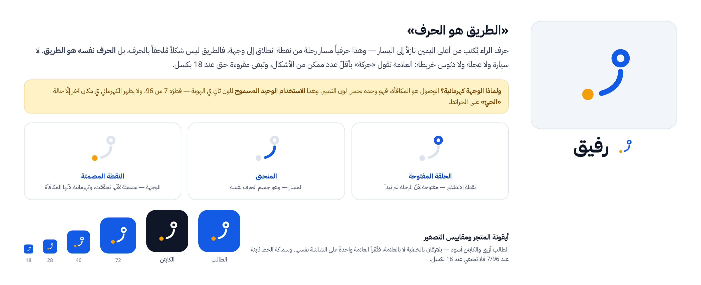

حرف **الراء** يُكتب من أعلى اليمين نازلاً إلى اليسار. وهذا — حرفياً — **مسار رحلة**
من نقطة انطلاق إلى وجهة. فالعلامة لا تُلحق طريقاً بالحرف، بل تكتشف أنّ الحرف **هو** الطريق:

| العنصر | معناه | لونه |
|---|---|---|
| **الحلقة المفتوحة** (أعلى اليمين) | نقطة الانطلاق — مفتوحة لأنّ الرحلة لم تبدأ | `#1259E3` أزرق العلامة |
| **المنحنى** | المسار — وهو جسم الـ«ر» نفسه، لا زخرفة مُضافة | `#1259E3` أزرق العلامة |
| **النقطة المصمتة** (أسفل اليسار) | الوجهة — مصمتة لأنّها تحقّقت | `#F59E0B` **كهرماني** |

**ولماذا الوجهة كهرمانية؟** الوصول هو المكافأة، فهو وحده يحمل لون التمييز.
وهذا **الاستخدام الوحيد المسموح** للون ثانٍ في الهوية — قطر النقطة `7/96`،
ولا يظهر الكهرماني في أي مكان آخر إلّا حالة **«الحيّ»** على الخرائط.

لا سيارة، ولا عجلة، ولا دبّوس خريطة. العلامة تقول «حركة» بثلاثة أشكال فقط،
وسماكة خطّها ثابتة عند `7/96` فتبقى مقروءة عند **18 بكسل**.

| النسخة | متى تُستخدم |
|---|---|
| **الأساسية** | مسار أزرق + نقطة كهرمانية · على أبيض أو رمادي فاتح |
| **على داكن** | مسار أبيض + نقطة كهرمانية · شرائح الكابتن والسبلاش الداكن |
| **أحادية اللون** | لون واحد للجميع · الطباعة، الحفر، الـfavicon عند 16 بكسل |
| **أيقونة الطالب** | حشوة `#1259E3` · مسار أبيض · نقطة كهرمانية |
| **أيقونة الكابتن** | حشوة `#0E1524` · مسار أبيض · نقطة كهرمانية |

التطبيقان يفترقان **بالخلفية لا بالعلامة**، فتُقرأ العلامة واحدةً على الشاشة نفسها.

### بار التنقّل

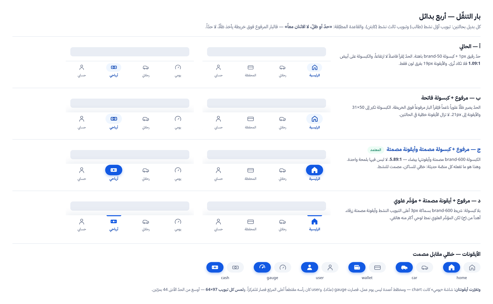

بُنيت **أربع بدائل وصُوِّرت جنباً إلى جنب** بدل الجدال فيها. والعيوب كانت **قابلة للقياس** لا ذوقية:
حدّ `1px` يُقرأ **فاصلاً** لا ارتفاعاً، وكبسولة `brand-50` على أبيض **1.09:1** فلا تكاد تُرى،
وأيقونة 19px تفرقها عن جوارها **درجةُ لون فقط**.

**المعتمد (ج):** الحدّ صار ظلّاً علوياً فيُقرأ البار مرفوعاً فوق الخريطة، والكبسولة `brand-600`
**مصمتة** بأيقونة بيضاء **مصمتة** — **5.89:1**. خطّي للساكن، مصمت للنشط.
ولمس كل تبويب **97×64**، أكثر من ضعف الحدّ الأدنى 44.

### السبلاش

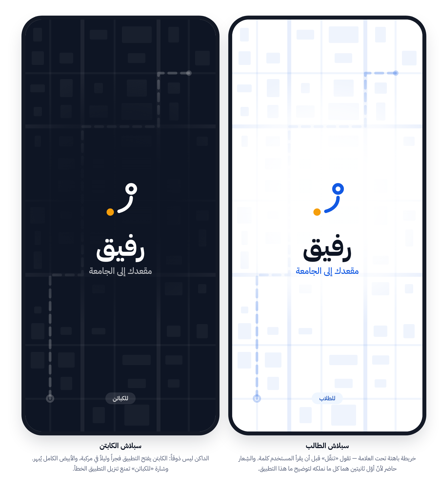

خريطة باهتة تحت العلامة تتبع مساراً واحداً من حلقة انطلاق إلى نقطة وصول —
تقول «تنقّل» قبل أن يقرأ المستخدم كلمة. والشِعار حاضر لأنّ أوّل ثانيتين هما كل ما نملكه
لتوضيح ما هذا التطبيق. وسبلاش الكابتن **داكن** لا لذوقٍ بل لأنّه يفتح التطبيق فجراً وليلاً
في مركبة، والأبيض الكامل يُبهر. وشارة «للطلاب»/«للكباتن» تمنع تنزيل التطبيق الخطأ.

### أصول المتجر

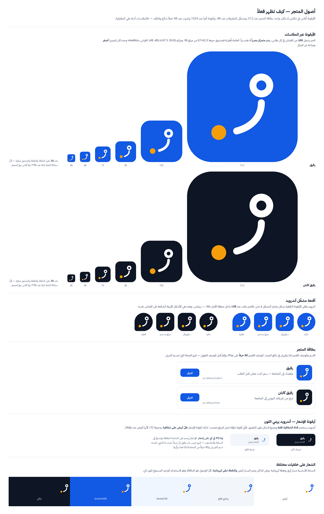

الأيقونة تُقاس في **مكانين لا مكان واحد**: بطاقة المتجر عند 512، ومشغّل التطبيقات عند 48.
وأيقونة تُقرأ عند 1024 وتذوب عند 48 خطأ شائع ومُكلف.

| القرار | الرقم الذي فرضه |
|---|---|
| **الحبر 60٪ من القماش** | كان **39٪** — لأنّ القياس كان بـ`viewBox` لا بصندوق الحبر |
| **تمركز بصري لا هندسي** | العلامة قُطرية: صندوق حبرها **62.5×67** من مربّع 96، ومركزه **(50.8، 47.5)** لا (48، 48) |
| **الأيقونة التكيّفية 58٪** | أندرويد يقصّها بشكل يختاره المشغّل — داخل منطقة الأمان 66٪ بهامش |
| **أيقونة الإشعار ظلّ أبيض** | أندرويد يستخدم **قناة الشفافية فقط** ويصبغ الشكل. أي أيقونة ملوَّنة تصل **مربّعاً مصمتاً** |
| **سماكة الخط 7/96 ثابتة** | لا تُقاس مع الحجم، فتبقى الحلقة والنقطة مميَّزتين عند **36 بكسل** |

---

## الألوان — المرجع الكامل

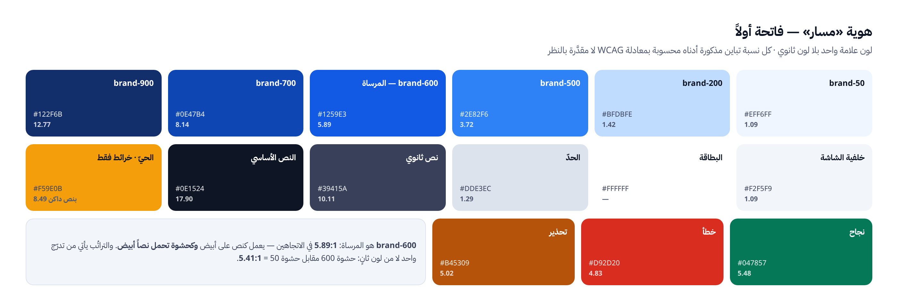

**لون علامة واحد، بلا لون ثانوي.** والتراتُب البصري يأتي من تدرّج واحد لا من لون ثانٍ.
كل نسبة أدناه **محسوبة بمعادلة WCAG 2.1 لا مقدَّرة بالنظر**، والعمود الأخير يقول
ما يصلح له اللون فعلاً — فليس كل لون يصلح نصّاً.

### تدرّج العلامة

| التوكن | Hex | على أبيض | على `n900` | الدور |
|---|---|---|---|---|
| `brand-50` | `#EFF6FF` | 1.09 | 16.76 | خلفية الحالة المختارة · شرائح المعلومات |
| `brand-100` | `#DBEAFE` | 1.22 | 14.95 | هالة النقطة الحيّة · حدّ خفيف |
| `brand-200` | `#BFDBFE` | 1.42 | 12.84 | أعمدة ثانوية في المخطّطات |
| `brand-300` | `#8EC1FD` | 1.88 | 9.72 | حالات معطَّلة |
| `brand-400` | `#5AA2FB` | 2.63 | 6.94 | تدرّجات · لا نصّ |
| `brand-500` | `#2E82F6` | 3.72 | 4.90 | تمييز ثانوي · **لا يصلح نصّاً على أبيض** |
| **`brand-600`** | **`#1259E3`** | **5.89** | 3.10 | **المرساة** — نصّ *وحشوة* |
| `brand-700` | `#0E47B4` | 8.14 | 2.24 | الضغط · نصّ على `brand-50` |
| `brand-800` | `#0F3A8C` | 10.48 | 1.74 | عناوين على خلفية زرقاء فاتحة |
| `brand-900` | `#122F6B` | 12.77 | 1.43 | أعمق درجة · الظلال ملوَّنة منها |

**لماذا `brand-600` هي المرساة:** **5.89:1 في الاتجاهين** — تعمل نصّاً على أبيض *وحشوةً
تحمل نصّاً أبيض*. لون واحد يؤدّي الدورين، فلا حاجة إلى ثانٍ.
والتراتُب من تدرّج واحد: حشوة `600` مقابل حشوة `50` = **5.41:1**.

### الرماديّات — 13 درجة باردة

| التوكن | Hex | على أبيض | الدور |
|---|---|---|---|
| `n0` | `#FFFFFF` | 1.00 | البطاقة · الشيت |
| `n25` | `#F9FAFB` | 1.05 | صفوف الجدول المتناوبة |
| `n50` | `#F2F5F9` | 1.09 | **خلفية الشاشة** · رأس الجدول |
| `n100` | `#E9EDF4` | 1.17 | الفواصل داخل البطاقة |
| `n200` | `#DDE3EC` | 1.29 | **الحدّ الافتراضي** |
| `n300` | `#C6CEDA` | 1.59 | مقبض الشيت · مسار المفتاح |
| `n400` | `#96A0B2` | 2.64 | أيقونات معطَّلة · **لا نصّ** |
| `n500` | `#67728A` | 4.83 | نصّ مساعد · تسميات |
| `n600` | `#4E5872` | 7.09 | نصّ ثانوي |
| `n700` | `#39415A` | 10.11 | أيقونات · نصّ متن |
| `n800` | `#232939` | 14.51 | عناوين ثانوية |
| `n900` | `#0E1524` | 18.24 | **النصّ الأساسي** |

### الدلالات — كلّها تعبر AA

| التوكن | Hex | على أبيض | الخفيف | الدور |
|---|---|---|---|---|
| `ok` | `#047857` | **5.48** | `#ECFDF5` | نجاح · معتمد · رصيد كافٍ |
| `bad` | `#D92D20` | **4.83** | `#FEF3F2` | خطأ · مرفوض · استغاثة |
| `warn` | `#B45309` | **5.02** | `#FFFBEB` | قيد المراجعة · تجاوز مهلة |
| `live` | `#F59E0B` | 2.15 ✗ | `#FEF3C7` | **الحيّ — خرائط والشعار فقط** |

### الاستثناء الكهرماني — قاعدة صريحة

`live` `#F59E0B` هو **2.15:1** على أبيض، فهو **لا يصلح نصّاً ولا يحمل نصّاً أبيض**.
مسموح في موضعين فقط:

1. **نقطة الوجهة في الشعار** — شكل مصمت لا نصّ فيه.
2. **حالة «الحيّ» على الخرائط** — علامة المركبة المتحرّكة ومؤشّر «جارية»،
   وأي نصّ فوقه يكون `#7C4A03` على `live-soft` (**6.65:1**).

ممنوع في: الأزرار، والشارات النصّية، والروابط، والأيقونات خارج الخريطة.

### قرارات لونية ولماذا اتُّخذت

| القرار | الرقم الذي فرضه |
|---|---|
| **رفض الكحلي `#002045`** | **16.25:1** على أبيض ≈ أسود. فاضطرّت الهوية القديمة إلى لون ثانٍ داكن (تيركواز `#006A65` = 6.46) والفرق بينهما **2.51:1** فقط ⇒ **صفر تراتُب**. المشكلة كانت في *الإضاءة* لا في درجة اللون. |
| **`warn` من `#F79009` إلى `#B45309`** | القديم **2.35:1** كنصّ — يسقط AA، ويظهر في **كل** شارة «قيد المراجعة». |
| **الكهرماني بنصّ داكن لا أبيض** | أبيض على `#F59E0B` = **2.15:1**. |
| **رفض التيركواز على الخرائط** | كان يذوب في أخضر الحدائق على بلاطات الخريطة الفاتحة. |
| **حذف الوضع الداكن بالكامل** | كان متناقضاً: `colors.ts` يقول فاتح فقط، و`scheme.ts` فيه لوحة داكنة كاملة، و**57** أداة `dark:` تشير إلى ألوان فاتحة. |

### بقيّة التوكنز

| المحور | القيم | القاعدة |
|---|---|---|
| **الخطّ** | IBM Plex Sans Arabic · **400 / 500 / 700** فقط | لا `extrabold` — كان وهمياً في 40+ موضعاً |
| **الأنصاف** | `12` تحكّم · `16` بطاقة · `24` شيت | ثلاث قيم، لا رابعة |
| **الارتفاع** | L0 مسطّح · L1 `sh-md` · L2 `sh-lg` · L3 حوار | **«حدّ أو ظلّ، لا الاثنان معاً»** |
| **المسافات** | أساس 4 · الهامش الجانبي `16` | |
| **الارتفاعات** | تحكّم `46` · شريط تبويب `64` | اللمس ≥ **44** · **54** في وضع الرحلة |
| **الظلال** | ملوَّنة من `rgba(18,47,107,…)` | ظلّ رمادي محايد يُقذِر الأزرق |
| **الأيقونات** | Lucide حصراً · سماكة `1.75` | عائلة واحدة، لا خلط |

---

## المزايا

<table>
<tr>
<td width="50%" valign="top">

&nbsp; **التجميع من منطقة إلى جامعة**
الطلاب المتقاربون سكناً ووقتاً في مركبة واحدة. الطالب يدفع مقعداً لا رحلة.

&nbsp; **سعر ثابت معلن**
مصفوفة نطاقات لا عدّاد. الطالب يعرف كلفته قبل الطلب، وهي نفسها كلّ يوم.

&nbsp; **نافذة تجميع لا إرسال فوري**
المنصّة تجمع الطلبات قبل الإرسال، فتبقى الرحلة مُجدية للكابتن بلا رفع سعر الطالب.

&nbsp; **تتبّع حيّ**
موقع المركبة والوقت المتوقّع على الخريطة، بلون مخصَّص للحالة الحيّة.

&nbsp; **سلامة ظاهرة**
زرّ استغاثة ظاهر في كل شاشة رحلة، ومشاركة الرحلة، ورمز صعود من أربعة أرقام.

&nbsp; **محفظة بلا نقد**
شحن عبر CliQ بمرجع إلزامي، ودفتر مزدوج القيد، وكل حركة لها سطر يفسّرها.

</td>
<td width="50%" valign="top">

&nbsp; **توثيق الكابتن**
رخصة القيادة، وترخيص المركبة، والتأمين، وشهادة عدم محكومية — بمراجعة بشرية.

&nbsp; **تقييم متبادل**
الطالب يقيّم الكابتن والعكس، والتقييم المنخفض يفتح مساراً إدارياً.

&nbsp; **لوحة تشغيل**
مؤشّرات بأهدافها، وطابور «يحتاج إجراءً»، ومتوسّط المقاعد المشغولة كمؤشّر صحّة.

&nbsp; **فصل الواجبات والتدقيق**
صلاحيات مفصولة (المشرف لا يشحن محفظة ولا يعتمد سحباً)، وسجلّ تدقيق لكل حركة حسّاسة.

&nbsp; **عربي أولاً · RTL أصيل**
الاتجاه من اليمين ليس ترجمة لاحقة: الأرقام معزولة ثنائياً، والعملة لا تنقلب.

&nbsp; **دعم ونزاعات**
محادثة داخل الرحلة، وشكاوى بمهل SLA، ومسار نزاع للرحلات المدفوعة.

</td>
</tr>
</table>

> **الوضوح واجب:** الشيفرة موجودة لكلّ ما سبق في الباكند، لكن المشروع **قبل الإطلاق**.
> ما يعمل وما لا يعمل مفصَّل في [حالة المشروع](#حالة-المشروع--بصراحة) و[`docs/AUDIT.md`](docs/AUDIT.md).

---

## الصوت — كيف يتكلّم رفيق

| الطبقة | النصّ | أين تُستخدم |
|---|---|---|
| **الشِعار** | **مقعدك إلى الجامعة** | السبلاش · المتاجر · لوحة العلامة |
| **الوعد** | تدفع مقعداً، لا رحلة | تحت الشِعار · صفحة التسعير |
| **الإنجليزية** | YOUR SEAT TO CAMPUS | قوائم المتاجر الإنجليزية |
| **الجملة الطويلة** | نجمع طلاب المنطقة نفسها في رحلة واحدة إلى الجامعة، بسعر ثابت معلن قبل الطلب | متجر التطبيقات · الموقع |

**قواعد النصّ:** لا مبالغة ولا وعد لا نملكه. الرقم يُذكر صريحاً لا «بأسعار مناسبة».
والحقيقة غير المريحة تُقال في الواجهة لا تُخفى — «الشحنة لا تُقيَّد إلّا بعد الاعتماد»
مكتوبة في شاشة الشحن لأنّ إخفاءها يُنتج شكوى دعم لكل شحنة.

---

## البنية التقنية

```
Rafeeq-JO
├─ backend/                     Laravel 12 · PHP 8.4 · PostgreSQL + PostGIS · Redis
│  ├─ Core/                     ما تشترك فيه الموديولات
│  │  ├─ Audit/                 سجلّ التدقيق (AuditLogger)
│  │  ├─ Permissions/           الأدوار والصلاحيات (HasRoles)
│  │  ├─ Repositories/          BaseRepository
│  │  ├─ Services/              BaseService
│  │  ├─ Http/                  متحكّمات ووسائط واستجابات موحَّدة
│  │  └─ Exceptions/            DomainException · BusinessRule · Authorization
│  ├─ Infrastructure/           المتكاملات الخارجية خلف عقود
│  │  ├─ Sms/                   HTTP · WhatsApp Cloud · Log · Fallback
│  │  ├─ Push/                  FCM · Log
│  │  ├─ Maps/                  المسافات والمسارات
│  │  └─ Gpt/                   OpenAI · Null
│  └─ Modules/                  33 موديولاً، كلٌّ منها Controllers · Services
│     │                         Models · Requests · Resources · Routes · Migrations
│     ├─ RideRequests/ Matching/     ◄── المنتج الأساسي: الطلب الفوري والمطابقة
│     ├─ Trips/ Routes/ PickupPoints/
│     ├─ Wallet/ Payments/ Payouts/ Subscriptions/ Coupons/
│     ├─ Drivers/ Students/ Universities/ Areas/ Zones/ Addresses/
│     ├─ Safety/ Disputes/ Complaints/ Support/ Ratings/
│     └─ Auth/ Users/ Chat/ Notifications/ Reports/ Settings/ AI/ …
│
└─ frontend/                    مساحة عمل npm واحدة
   ├─ student-app/              Expo 51 · React Native · تطبيق الطالب
   ├─ driver-app/               Expo 51 · React Native · تطبيق الكابتن
   ├─ admin-dashboard/          Next.js 14 · لوحة الإدارة
   └─ packages/                 مشترك بين الثلاثة (توكنز التصميم، أنواع، عميل API)
```

**قواعد المعمارية:** الموديول لا يستورد من موديول آخر مباشرةً — يمرّ بـ`Core` أو بعقد.
والمنطق في `Service` لا في `Controller`، والوصول للبيانات في `Repository`.
كل متكامل خارجي خلف واجهة له بديل `Null`/`Log` للاختبار.
التفصيل في [`docs/engineering/ARCHITECTURE.md`](docs/engineering/ARCHITECTURE.md).

---

## التشغيل المحلي

**المتطلبات:** PHP 8.4 · Composer · Node 20 · PostgreSQL 15 مع PostGIS · Redis

```bash
git clone https://github.com/hamzatal/Rafeeq-JO.git
cd Rafeeq-JO
```

### الباكند

```bash
cd backend
cp .env.example .env
composer install
php artisan key:generate
php artisan migrate --seed          # يزرع الأدوار والصلاحيات والجامعات
php artisan serve
```

### الواجهات

```bash
cd frontend
npm ci                              # مساحة عمل واحدة للثلاثة

npm run start --workspace=student-app
npm run start --workspace=driver-app
npm run dev   --workspace=admin-dashboard
```

### الفحوص — وهي نفسها التي يشغّلها CI

```bash
# الباكند
cd backend
./scripts/pg-test.sh                               # 248 اختباراً على Postgres
COVERAGE=1 ./scripts/pg-test.sh                    # مع التغطية
vendor/bin/pint --test                             # التنسيق
php -d memory_limit=1G vendor/bin/phpstan analyse   # التحليل الساكن · level 5

# الواجهات
cd frontend
npm run typecheck --workspace=student-app
npm run typecheck --workspace=driver-app
npm run typecheck --workspace=admin-dashboard
npm run lint      --workspace=admin-dashboard
npm run test      --workspace=packages/shared      # 27 اختباراً للعملة
npm run check:money                                # بوّابة: لا مبلغ يُصاغ خارج @rafeeq/shared
```

### إعادة توليد صور التصميم

```bash
cd docs/design/src
npm i -D playwright && npx playwright install chromium
node gen-student.mjs && node gen-driver.mjs && node gen-admin.mjs \
  && node gen-money.mjs && node gen-extra.mjs && node shoot.mjs
node gen-readme.mjs && node shoot-readme.mjs && node gen-icons.mjs
```

---

## حالة المشروع — بصراحة

**المشروع قبل الإطلاق.** الباكند مبنيّ بمعمارية سليمة، لكن خمس جولات تدقيق مستقلة
كشفت مشاكل مالية وقانونية **مانعة للإطلاق**. لن نُطلق قبل إغلاقها، والتقرير كامل
وبأخطائه الظاهرة في [`docs/AUDIT.md`](docs/AUDIT.md).

| المحور | التقييم | ملاحظة |
|---|---|---|
| معمارية الباكند | 🟢 8.5 / 10 | modular نظيف · لا SQL injection · لا mass assignment |
| سلامة دفتر المحفظة | 🟢 8 / 10 | `lockForUpdate` صحيح · idempotency · عكس غير هدّام |
| نظافة الريبو | 🟢 7 / 10 | كانت 2 / 10 — أُصلحت |
| فصل الواجبات المالية | 🟡 قيد الإصلاح | صُلح في PR #71 · باقي التصليب |
| الدقة المالية في الرحلات | 🟡 6 / 10 ↑ | كان 3 — أُصلح تبخُّر المال والانزياح والأقفال. باقٍ الاحتساب المزدوج في التقارير (المرحلة 3) |
| التصميم البصري | 🔴 3 / 10 | الهوية الجديدة مصمَّمة، وتنفيذها المراحل 6–10 |
| الامتثال للمتاجر | 🟡 7 / 10 ↑ | كان 2 — أُصلحت الأصول والأذونات وحذف الحساب والروابط القانونية. باقٍ ترقية Expo SDK ونشر الوثائق على نطاق حقيقي |
| الامتثال القانوني | 🔴 2 / 10 | تصريح الخصوصية يخالف الكود · ونموذج التجميع قد يحتاج رخصة **خطّ** لا رخصة تطبيق → [`JORDAN-COMPLIANCE`](docs/legal/JORDAN-COMPLIANCE.md) |
| **ترخيص المحفظة** | 🔴 **جديد** | حفظ رصيد العميل يحتاج **ترخيص بنك مركزي** — والدفتر الحالي قد يُستبدل بعميل لمرخَّص |
| الاختبارات | 🟢 7 / 10 ↑ | **248 خلفية + 27 واجهة** على **Postgres حقيقي** · التغطية مُفعَّلة في CI · الأقفال مُثبَتة باتصالَين |

### التقدّم

| المؤشّر | البداية | الآن | الهدف |
|---|---|---|---|
| CI على `main` | 🔴 أحمر | 🟢 **أخضر** | 🟢 |
| الفرع الافتراضي | `foundation` | ✅ **`main`** | `main` |
| فروع عن بُعد | 66 | ✅ **1** — `main` وحده | ≤ 5 |
| ملفات الوثائق | 20 | ✅ **5** | ≤ 6 |
| أصول ميتة | 7.4 MB | ✅ **0** | 0 |
| ألوان hex يدوية | 117 | 117 | **0** |
| بيئة الاختبار | SQLite (تُبطل الأقفال) | ✅ **Postgres** | Postgres |
| اختبارات الخلفية | 198 | ✅ **248** | — |
| اختبارات الواجهة | 0 | ✅ **27** | — |
| مُثبَتات PHPStan | 216 | ✅ **211** | ↓ |

### المراحل — 12 مرحلة إلى الإطلاق

| # | المرحلة | المدّة | الحالة |
|---|---|---|---|
| 0 | الأساس · CI · تنظيف الريبو والوثائق | — | ✅ **مكتملة** |
| 1 | إسعاف مالي وأمني — 20 بنداً | ✅ | ✅ **مكتملة** |
| 2 | الامتثال — متاجر + تنظيم أردني | ✅ | ✅ **مكتملة** |
| — | الدفع النقدي · مجلّد التسويق · جرد الشاشات | — | ✅ **مكتملة** |

| 3 | الخصوصية ودفتر البيانات | 5 أيام | ⏳ |
| 4 | الحذف — المزايا والشاشات الميتة | 5 أيام | ⏳ |
| 5 | محرّك التسعير «المقعد الثابت» | 5 أيام | 🔒 محجوبة على 7 أرقام |
| 6 | توكنز التصميم | 4 أيام | ⏳ |
| 7 | مكتبة المكوّنات | 5 أيام | ⏳ |
| 8 | تطبيق الطالب | 5 أيام | ⏳ |
| 9 | تطبيق الكابتن | 5 أيام | ⏳ |
| 10 | لوحة الإدارة | 5 أيام | ⏳ |
| 11 | التصليب — تغطية · أحمال · أمان | 6 أيام | ⏳ |
| 12 | الإطلاق الرسمي | 5 أيام | ⏳ |

**≈ 63 يوم عمل ≈ 13 أسبوعاً.** الخطة كاملة بمعايير قبول لكل مهمة في [`docs/ROADMAP.md`](docs/ROADMAP.md).

---

## الوثائق

| الملف | ما فيه |
|---|---|
| [`docs/README.md`](docs/README.md) | **خريطة الوثائق** — ابدأ من هنا |
| [`docs/ROADMAP.md`](docs/ROADMAP.md) | **المصدر الوحيد للحقيقة.** 12 مرحلة · كل مهمة برقم وملفات ومعيار قبول وتبعية وحجم |
| [`docs/AUDIT.md`](docs/AUDIT.md) | خمس جولات تدقيق مدموجة · **والتصحيحات حيث أخطأ التحليل** |
| **`docs/engineering/`** | |
| ├ [`ARCHITECTURE.md`](docs/engineering/ARCHITECTURE.md) | حدود الموديولات · العقود · Service/Repository |
| ├ [`DATABASE.md`](docs/engineering/DATABASE.md) | **قرارات** السكيما: UUIDv7 · الفلس الصحيح · ثلاث سياسات حذف · **والفجوات الخمس بأرقام مقيسة** |
| ├ [`SCHEMA.generated.md`](docs/engineering/SCHEMA.generated.md) | **مُولَّد** — 68 جدولاً بكل عمود وفهرس · `php artisan db:schema-doc` |
| └ [`OPERATIONS.md`](docs/engineering/OPERATIONS.md) | النشر · البيئات · المراقبة · الطوارئ |
| **`docs/product/`** | |
| └ [`PRICING.md`](docs/product/PRICING.md) | نموذج «المقعد الثابت» · نطاقات A–F · اقتصاديات الكابتن · ولماذا رُفض `surge` |
| **`docs/design/`** | |
| ├ [`README.md`](docs/design/README.md) | نظام التصميم · التوكنز · التباين المحسوب · الشعار |
| ├ [`SCREENS.md`](docs/design/SCREENS.md) | **جرد 77 شاشة** — كل صفحة في المشروع بحالتها |
| └ `readme/` · `v2/` · `src/` | الصفائح المصوَّرة · وأصول الريدمي · **والمصادر** |
| **`docs/legal/`** | |
| ├ [`JORDAN-COMPLIANCE.md`](docs/legal/JORDAN-COMPLIANCE.md) | **تعليمات LTRC 74/2025 بنداً ببند** · ترخيص المحفظة · PDPL · 9 أسئلة للمحامي |
| ├ [`privacy-ar.md`](docs/legal/privacy-ar.md) | الخصوصية — **مكتوبة من الكود**، وكل معالج فرعي مُفصَح |
| ├ [`terms-ar.md`](docs/legal/terms-ar.md) | الشروط — بإصدار مُخزَّن وجدول إلغاء واسترداد |
| └ [`data-retention-ar.md`](docs/legal/data-retention-ar.md) · [`prohibited-items-ar.md`](docs/legal/prohibited-items-ar.md) | مدد الاحتفاظ · والمواد الممنوعة |
| **`marketing/`** | |
| ├ [`posts/`](marketing/posts/) | **26 صورة جاهزة للنشر + 20 نصّاً** — كل صورة معها تعليقها |
| ├ [`README.md`](marketing/README.md) | الفهرس وقواعد الاستخدام |
| └ [`STRATEGY.md`](marketing/STRATEGY.md) | الموضع · التقويم · الإعلانات · الأرقام التي تُقاس |

---

## أصول العمل

1. **فرع واحد `main`.** كل عمل في `feat/` · `fix/` · `chore/` · `docs/`، وينتهي بـPR ثم يُحذف فرعه.
2. **CI أخضر إلزامي.** بلا استثناء، وبلا `--no-verify`.
3. **رقم Issue هو المعرّف.** لا ترقيم `RFQ-###` جديد.
4. **كل إصلاح مالي أو أمني يحتاج اختباراً** يفشل قبله وينجح بعده.
5. **لا مرحلة تبدأ قبل إغلاق بوّابة سابقتها.**
6. **الحذف قبل الإضافة.**
7. **لا عمل خارج [`ROADMAP.md`](docs/ROADMAP.md).** غير الموجود فيها لا يُنفَّذ.

---

<div align="center">


**رفيق** · منصّة النقل الجامعي المشترك في الأردن
رخصة خاصّة — كل الحقوق محفوظة

</div>
