# 🎨 معرض تصاميم رفيق — 30 اتجاه شكل ولاي-آوت

> التركيز هون على **الشكل واللاي-آوت والأشكال والرموز** (مش الألوان — اللون ثانوي ومنظبطه بعد ما تختار). كل صورة هي الشاشة الرئيسية بستايل شكلي مختلف جذرياً. الصور مولّدة كـ SVG وتنعرض مباشرة تحت — **قلّي رقم الشكل اللي يعجبك** (أو امزج، مثلاً: «شكل ٦ مع رموز شكل ٣٠»).

| | | |
|:--:|:--:|:--:|
| **1. أونيكس** — Onyx  | **2. نيومورفيزم** — Neumorphism 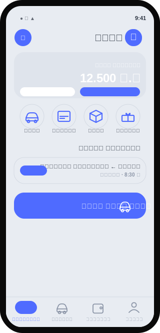 | **3. زجاجي** — Glassmorphism 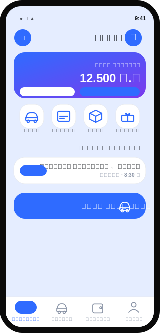 |
| **4. بروتالِست** — Neo-Brutalist 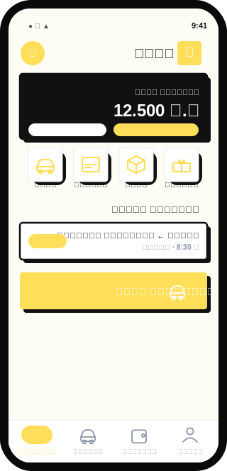 | **5. سكويركل iOS** — Squircle iOS  | **6. تذكرة سفر** — Boarding Ticket  |
| **7. كبسولات** — Pill / Capsule 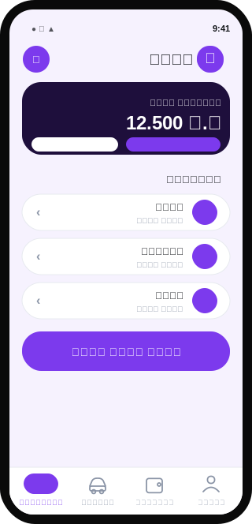 | **8. مجلّة** — Editorial 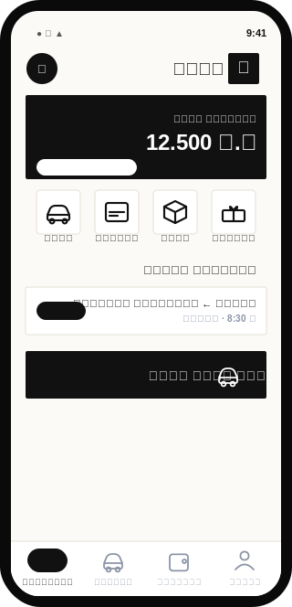 | **9. الخريطة أولاً** — Map-First  |
| **10. أكسنت مزدوج** — Dual-Accent 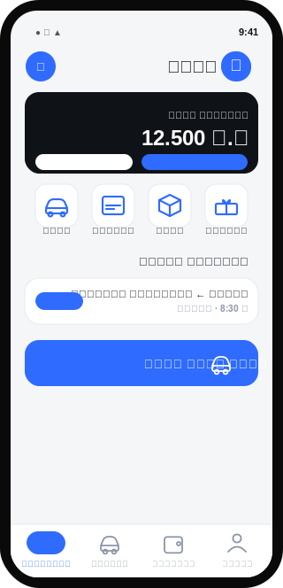 | **11. قرمزي** — Crimson 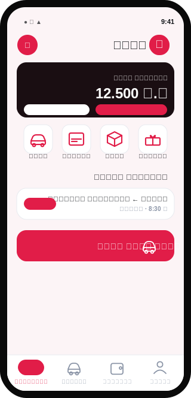 | **12. أعماق المحيط** — Ocean Deep 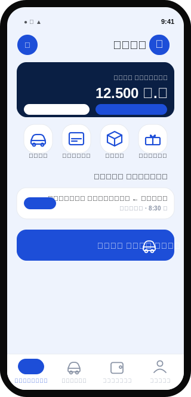 |
| **13. خيط المسار** — Route-Line  | **14. نعناعي** — Mint Fresh 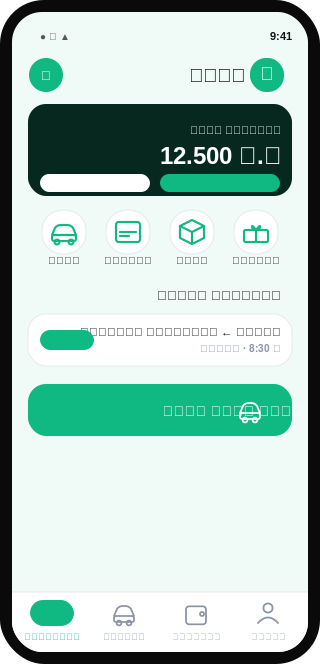 | **15. مرجاني** — Sunset Coral 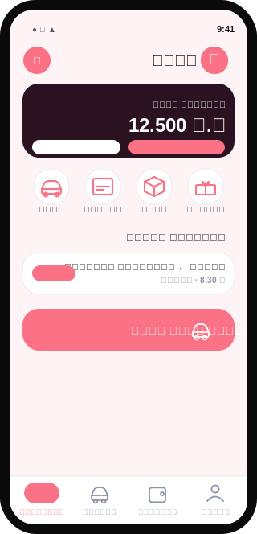 |
| **16. ذهبي فاخر** — Golden Hour  | **17. سماوي كهربائي** — Electric Cyan 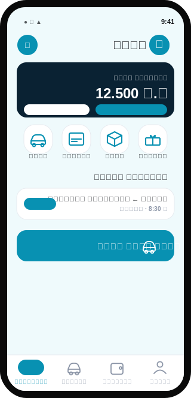 | **18. أرقام ضخمة** — Big Numbers 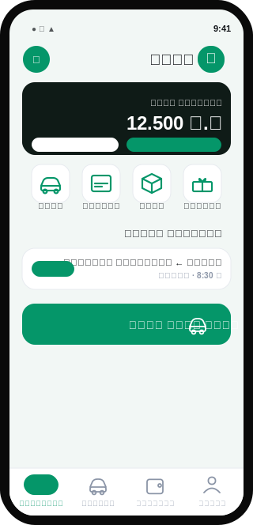 |
| **19. محادثة** — Conversational 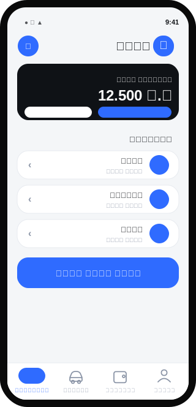 | **20. ستيكرز** — Sticker / Playful 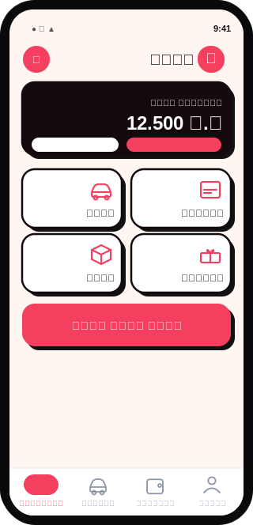 | **21. أقسام مؤطّرة** — Segmented 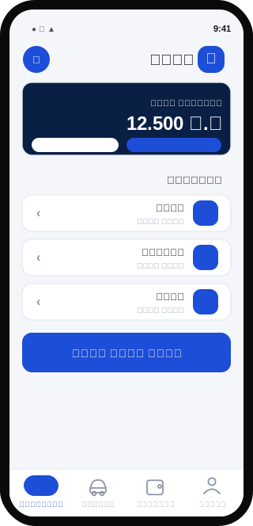 |
| **22. هيدر منحني** — Wave Header 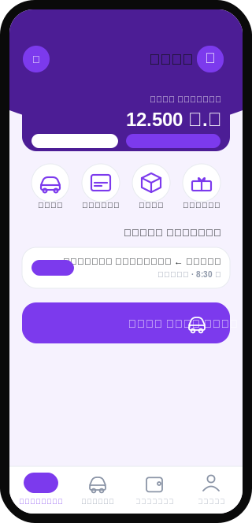 | **23. شريط جانبي** — Vertical Rail 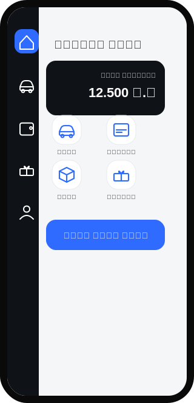 | **24. كثيف** — Compact Dense 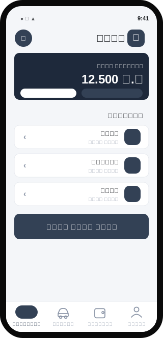 |
| **25. زر مركزي** — Centered CTA 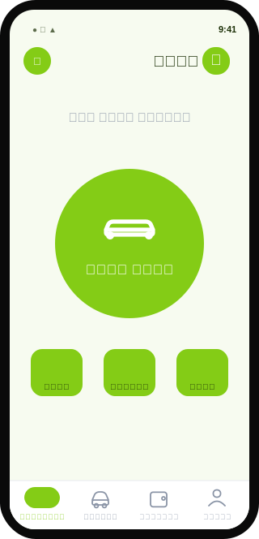 | **26. عمق طبقات** — Layered Depth 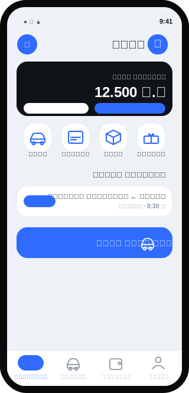 | **27. شيتات** — Stacked Sheets 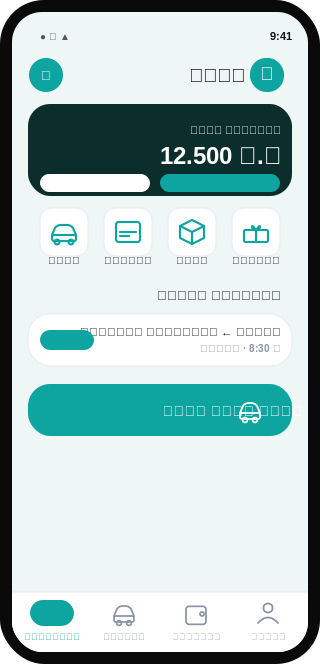 |
| **28. نصّي** — Text-Forward 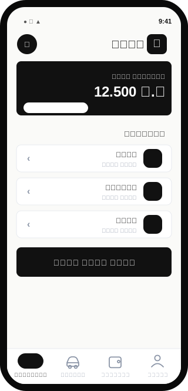 | **29. تدرّج ميش** — Gradient Mesh 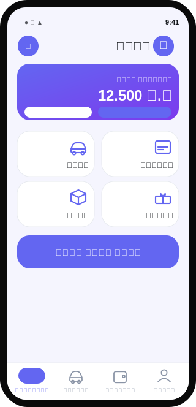 | **30. كوفي عربي** — Kufi Geometric 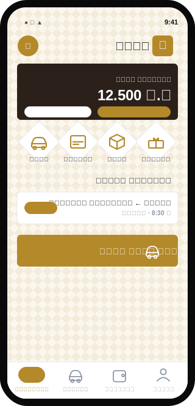 |

---
### وصف مختصر
- **1. أونيكس** (Onyx): أسود حبري + لون واحد، عالمي ونظيف.
- **2. نيومورفيزم** (Neumorphism): أسطح ناعمة بارزة، ملمس هادئ.
- **3. زجاجي** (Glassmorphism): بطاقات زجاجية بتدرّج، عمق حديث.
- **4. بروتالِست** (Neo-Brutalist): حدود سميكة وظل حاد، جريء جداً.
- **5. سكويركل iOS** (Squircle iOS): زوايا كبيرة ناعمة بأسلوب iOS.
- **6. تذكرة سفر** (Boarding Ticket): بطاقات بقصّات تذكرة سفر — موتيف نقل.
- **7. كبسولات** (Pill / Capsule): كل شي كبسولات دائرية، ودّي.
- **8. مجلّة** (Editorial): خطوط رفيعة وفراغات، إحساس مجلة.
- **9. الخريطة أولاً** (Map-First): خريطة أولاً وعناصر بسيطة.
- **10. أكسنت مزدوج** (Dual-Accent): أساس محايد + لون لكل دور.
- **11. قرمزي** (Crimson): أحمر قرمزي، طاقة عالية.
- **12. أعماق المحيط** (Ocean Deep): أزرق عميق كلاسيكي واثق.
- **13. خيط المسار** (Route-Line): خيط مسار يربط العناصر.
- **14. نعناعي** (Mint Fresh): نعناعي بأشكال عضوية.
- **15. مرجاني** (Sunset Coral): مرجاني دافئ بأشكال منحنية.
- **16. ذهبي فاخر** (Golden Hour): ذهبي فاخر + أيقونات معيّنة.
- **17. سماوي كهربائي** (Electric Cyan): سماوي تقني نظيف.
- **18. أرقام ضخمة** (Big Numbers): أرقام ضخمة بارزة.
- **19. محادثة** (Conversational): فقاعات محادثة، مساعد ذكي.
- **20. ستيكرز** (Sticker / Playful): أيقونات ملصقات، مرح.
- **21. أقسام مؤطّرة** (Segmented): أقسام مؤطّرة منظّمة.
- **22. هيدر منحني** (Wave Header): رأس منحني تتداخل معه البطاقة.
- **23. شريط جانبي** (Vertical Rail): شريط تنقّل عمودي جانبي.
- **24. كثيف** (Compact Dense): كثيف — عناصر صغيرة كثيرة.
- **25. زر مركزي** (Centered CTA): زر «اطلب» مركزي عملاق.
- **26. عمق طبقات** (Layered Depth): ظلال قوية وعمق طبقات.
- **27. شيتات** (Stacked Sheets): شيتات بحواف علوية متتالية.
- **28. نصّي** (Text-Forward): تايبوغرافي بأيقونات رفيعة.
- **29. تدرّج ميش** (Gradient Mesh): تدرّجات ناعمة بأسلوب SaaS.
- **30. كوفي عربي** (Kufi Geometric): زخرفة هندسية + خط كوفي عربي.
